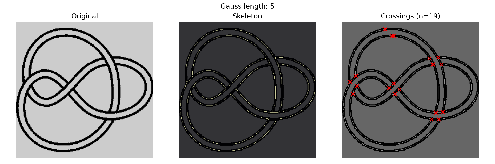
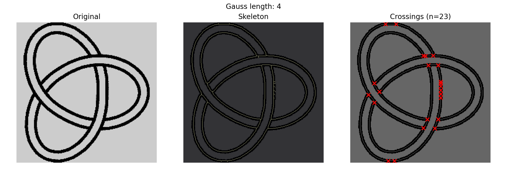
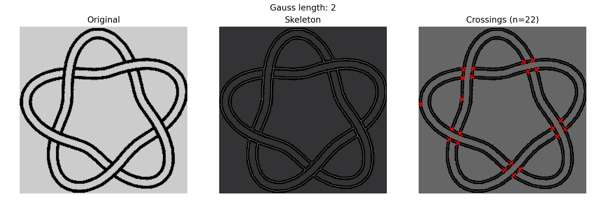

# Visualizations

This document reports qualitative visualizations generated by the current preprocessing and Gauss/PD extraction pipeline. Each figure shows (1) the original image, (2) the skeletonized representation, and (3) detected crossing locations overlaid on the skeleton. The metrics below are reported directly from the current heuristic pipeline and should be interpreted as diagnostic, not ground truth.

## Method Summary
- Preprocessing: grayscale conversion, histogram equalization, Gaussian smoothing, adaptive thresholding (with Otsu fallback), morphological opening, skeletonization.
- Extraction: skeleton graph, spur pruning, junction clustering, graph simplification, edge pairing, and curve traversal.

## Figure Eight Knot (4_1)
**Source**: `raw_knot/4_1/4_1.gif`  \
**Output**: `results/figures/figure_eight_visualization.png`  \
**Detected crossings**: 19  \
**Gauss length**: 5

**Observation**: The pipeline detects a dense set of crossing candidates relative to the expected crossing number (4). This indicates that skeleton junction clustering and spur pruning are still conservative for this sample, producing extra junctions in the skeleton graph.

## Trefoil Knot (3_1)
**Source**: `raw_knot/3_1/3_1.gif`  
**Output**: `results/figures/trefoil_visualization.png`  
**Detected crossings**: 23  
**Gauss length**: 4

**Observation**: The junction count again exceeds the nominal crossing number (3). This suggests that local skeleton artifacts are being clustered into distinct crossings, which inflates the candidate count and alters traversal order.

## Five-One Knot (5_1)
**Source**: `raw_knot/5_1/5_1.gif`  \
**Output**: `results/figures/five_one_visualization.png`  \
**Detected crossings**: 22  \
**Gauss length**: 2

**Observation**: The high junction count and short Gauss sequence suggest fragmented traversal and over-segmentation of junction pixels. This is consistent with the heuristic nature of the extractor and highlights sensitivity to stroke thickness and local artifacts.

## Notes and Limitations
- Crossing counts are derived from clustered skeleton junctions and are sensitive to binarization and skeleton artifacts.
- Gauss length reflects the current traversal order; it is not guaranteed to match the theoretical Gauss code length for the knot.
- These figures are intended for qualitative inspection and pipeline debugging, not for quantitative evaluation.
